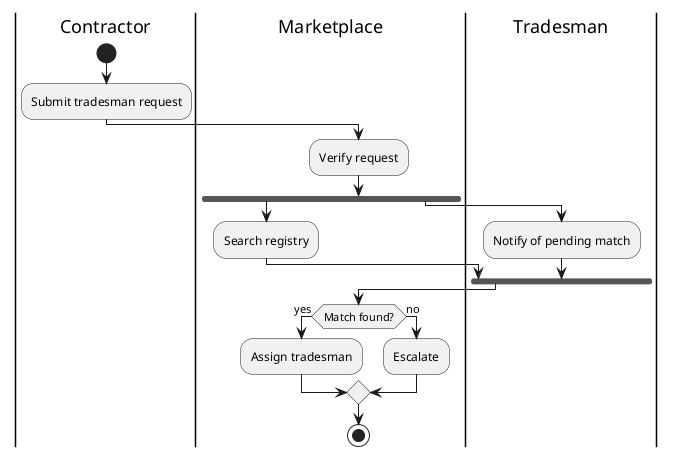

# Core Use Cases

## Canonical source

**Primary:** Löwy, *Righting Software*, [Chapter 4 §2.1 "Core Use Cases"](../../../research/rightingsoftware/OEBPS/xhtml/ch04.xhtml#ch04lev2sec3) and [§2.2 "The Architect's Mission"](../../../research/rightingsoftware/OEBPS/xhtml/ch04.xhtml#ch04lev2sec4).

**Supporting:**
- [Ch. 3 §1 "Use Cases and Requirements"](../../../research/rightingsoftware/OEBPS/xhtml/ch03.xhtml#ch03lev1sec1)
- [Ch. 4 §1 "Requirements and Changes"](../../../research/rightingsoftware/OEBPS/xhtml/ch04.xhtml#ch04lev1sec1)
- [Ch. 4 §2 "Composable Design"](../../../research/rightingsoftware/OEBPS/xhtml/ch04.xhtml#ch04lev1sec2)

**Worked example:** [Ch. 5 §1.4 "Use Cases"](../../../research/rightingsoftware/OEBPS/xhtml/ch05.xhtml#ch05lev2sec4) and the rest of ch. 5 §6 where each use case becomes a call chain. The TradeMe customer provided 8 use cases (Add Tradesman, Pay Tradesman, etc.) — the architect identified only **one** as core (Match Tradesman). Re-read the reasoning in ch. 5.

**Standard reference:** [Appendix C §3.1a–c](../../../research/rightingsoftware/OEBPS/xhtml/appc.xhtml#appclev1sec3) — capture behavior not functionality; describe with use cases; document nested conditions with activity diagrams.

## Input

State is git-as-DB: archistrator is a single Go-server repo whose canonical project state lives in `.aiarch/state/project.json` (a typed JSON aggregate). Markdown is a render-on-read of the typed state.

- The committed **mission** artifact → `.aiarch/state/project.json` → `.mission`
- The committed **glossary** artifact → `.glossary`
- The committed **volatilities** artifact → `.volatilities`
- The committed **scrubbedRequirements** artifact → `.scrubbedRequirements`
- The research corpus in `project.json`

## Output

The typed **`CoreUseCases`** model (Go shape in `server/internal/resourceaccess/projectstate/models_phase1.go`), committed to **`.aiarch/state/project.json` → `.coreUseCases`** — NOT a `core-use-cases.md` file; any markdown is a render-on-read of this slot. Per the two usage patterns (agentic/CI dispatch and local interactive), the agent emits the typed model and commits it into `.coreUseCases`; the server stages it (`StageArtifactForReview`) for the human review gate.

The model carries:

1. The **full raw list** of all use cases mentioned in research
2. The **2–6 core use cases** with behavior descriptions
3. **Rejection reasons** for each non-core use case
4. **Activity diagrams** (PlantUML activity diagrams, new syntax) for use cases with nested conditions, **using role-based swimlanes when the use case crosses multiple roles/areas of interest, and fork bars when paths execute concurrently** — carried as diagram source on the typed use-case entries (the renderer emits them; they are not separate files)

## Procedure

### Step 1 — List every raw use case

Trawl the research corpus in `project.json` and the committed `.scrubbedRequirements`. List every distinct use case mentioned, in customer language. Don't filter yet. Don't rename yet.

Format:

```markdown
## Raw use cases (all 17 mentioned in research)

1. Add a tradesman to the registry
2. Pay a tradesman after a job
3. Match a customer request to a tradesman
4. Terminate a tradesman's registration
5. Onboard a contractor
...
```

### Step 2 — Abstract toward core

The book is unambiguous (ch. 4 §2.1): *"Most of the use cases are variations of other use cases. The main required behavior has numerous permutations—for example, the normal case, the incomplete case, the case for a specific customer in a particular locale, the error case, and so on. There are only two types of use cases: core use cases and all other use cases."*

For each raw use case, ask:
1. **Does this represent the essence of the business** — what differentiates the system, what creates business value?
2. **Or is this a permutation/utility** — onboarding, payment, account management?
3. **Could a different abstraction encompass several raw use cases?** Core use cases often need a **new name** not present in customer vocabulary.

Look at TradeMe (ch. 5) as the worked example. Customer gave 8 use cases; architect chose ONE as core (Match Tradesman) because:
- Match Tradesman is what differentiates TradeMe from competitors
- Add/Terminate/Pay tradesman are mechanics, not business essence
- Several customer-stated use cases were actually variations of matching under different conditions

Per ch. 4: *"A core use case will almost always be some kind of an abstraction of other use cases, and it may even require a new term or name to differentiate it from the rest."*

### Step 3 — Target 2–6 core use cases

Per ch. 4 §2.1: *"the system will have only a handful of core use cases. In our practice at IDesign, we commonly see systems with surprisingly few core use cases. Most systems have as few as two or three core use cases, and the number seldom exceeds six."*

If you have >6, you have not abstracted enough. Push back on yourself.
If you have 1, you may have abstracted too far — look for distinct business pillars.

**Sanity check** (ch. 4): *"bring up a single-page marketing brochure for the system and count the number of bullets. You will likely have no more than three bullets."* The bullets ≈ the core use cases.

### Step 4 — Describe each core use case

For each core use case, write (if nested conditions exist, add an activity diagram — see the swimlane and fork/join guidance below):

```markdown
## Core Use Case: <Name>

**Actor:** Who triggers it
**Trigger:** What starts the flow
**Outcome:** What the system delivers
**Success path:** One paragraph
**Alternative / error paths:** Bulleted list

**Activity diagram:** (PlantUML new syntax, role-based swimlanes)
```

Per App C §3.1c: *"Document all use cases that contain nested conditions with activity diagrams."* Use **PlantUML activity diagrams (new syntax)** — the `start` / `:action;` / `if (cond?) then (yes) ... else (no) ... endif` / `repeat ... repeat while (cond?)` / `switch (val?) case (x) ... endswitch` / `fork ... fork again ... end fork` / `stop` vocabulary. Use `goto`/`label` for arbitrary loop-backs the structured constructs can't capture. **Do not use Mermaid `flowchart`** — PlantUML activity is more expressive (swimlanes, structured switch, fork, goto/label) and renders via the project's PlantUML hook. Wrap every diagram in `@startuml` / `@enduml` so the validator picks it up.

**Swimlanes (Pass 1 — use-case modeling):** Löwy introduces swimlanes during use-case modeling ([Ch. 5 §1.4 "Use Cases"](../../../research/rightingsoftware/OEBPS/xhtml/ch05.xhtml#ch05lev2sec4), "Simplifying the Use Cases"): *"It is useful to show the flow of control between roles, organizations, and other responsible entities, using 'swim lanes' in your activity diagrams"* — and notes that the technique will be used *"to both initiate and validate the design."* That means **two passes**: (1) here, labeling lanes by **area of interest / role / responsible entity** — NOT yet by subsystem; (2) later in [[the-method-architecture]] during call-chain validation, where lanes are remapped to specific subsystems (Pass 2). Add swimlanes to any use-case activity diagram that crosses more than one role or area of responsibility.

**Granularity rule — aim for ~3 lanes that map to future subsystems.** If your initial pass draws more than ~3 lanes, collapse sub-areas into their parent business concern. Löwy demonstrates this exact refactor at [Ch. 5 §1.5 Fig 5-21→5-22](../../../research/rightingsoftware/OEBPS/xhtml/ch05.xhtml#ch05lev2sec4): Fig 5-21 has 5 lanes (Client / Market / Regulations / Search / Membership); Fig 5-22 collapses to 3 (Client / Market / Membership) because *"Regulations and Search are all elements of the market"* — caption: *"This enables easy mapping to your subsystems design."* Each remaining lane should correspond to a future subsystem or an external participant — that is what *"to both initiate and validate the design"* means: the lanes you draw here pre-shape the subsystem boundaries you will commit to in [[the-method-architecture]]. **DON'T:** lanes are NEVER one-per-Manager, one-per-Engine, or one-per-ResourceAccess. Layer-typed lanes pre-bake the decomposition and defeat both Pass 1 and Pass 2.

**Fork/join:** Use a fork bar whenever two paths run **concurrently against the same subject** — for example, a publish-path and an observe-path against the same operated system, or a scheduled-cycle close and an event-driven dispute webhook against the same settlement cycle. Parallel execution is the central reason The Method prefers activity diagrams over flowcharts ([Ch. 3 §1.1, Fig 3-2](../../../research/rightingsoftware/OEBPS/xhtml/ch03.xhtml#ch03lev1sec1)): *"You cannot represent parallel execution, blocking, or waiting for some event to take place in a flowchart. Activity diagrams, by contrast, incorporate a notion of concurrency."*

Example diagram showing both role-based swimlanes (Pass 1 — areas of interest, not subsystem names) and a fork. Lane labels are **business roles / areas of interest** (names a customer would recognise), never Method layer names — `Manager`, `Engine`, `ResourceAccess` are Pass 2 subsystem labels that belong in [[the-method-architecture]], not here.



### Step 5 — Document the rejections

For every raw use case that did NOT make the core list, write one line explaining why:

```markdown
## Non-core use cases

| Raw use case | Why non-core |
|---|---|
| Pay tradesman | Standard payment mechanics; not business-differentiating |
| Add tradesman | Onboarding utility; a permutation of identity management |
| Terminate tradesman | Inverse of add; same observation |
| ... | ... |
```

This is important for two reasons:
1. **Trail for review.** PM and stakeholders can challenge the architect's rejection of any "obvious" use case.
2. **Future evolution.** When `/add-use-case` runs later, the non-core list in `.coreUseCases` confirms whether the new use case is a known variation or genuinely new.

### Step 6 — PM ratification

The PM is dispatched only at this checkpoint, not earlier. They review:

- Are the architect's core use case picks compatible with customer expectations?
- Is any rejected use case actually critical to a customer?
- Are the names recognizable to customers (or at least translatable)?

The PM **can push back**, but cannot unilaterally veto. The architect has abstraction taste; the PM has customer reality. Both must agree.

If they cannot agree, the dispute usually means one of:
- The architect over-abstracted (resolve by promoting one rejected use case to core)
- The PM is feature-attached (resolve by educating: features are integration, not architecture)

## Exit criteria (for router)

`.aiarch/state/project.json` → `.coreUseCases` holds the typed `CoreUseCases` model with:
- Raw list (complete)
- 2–6 core use cases (each with actor, trigger, outcome, paths, optional activity diagram)
- Rejection table for non-core
- PM ratification noted

Move to `the-method-architecture`.

## Anti-patterns to reject

- **>6 core use cases** — over-listing; abstract further.
- **Core use cases named exactly as customers named them** — usually means no abstraction happened. Force a rename to expose the underlying business essence.
- **CRUD as core** ("Create Order", "Update Order") — these are mechanics, never core.
- **No activity diagram** for a use case that has alternative paths — App C requires it. Activity diagrams use PlantUML new syntax; Mermaid `flowchart` is no longer accepted.
- **Rejections without reasons** — every non-core needs a one-line justification.
- **Missing swimlanes on a multi-role use case** — any use case that crosses more than one role or area of interest must have swimlanes. Omitting them loses the clarity that Löwy shows as essential for *"transform, clarify, and consolidate the raw data"* ([Ch. 5 §1.4](../../../research/rightingsoftware/OEBPS/xhtml/ch05.xhtml#ch05lev2sec4), "Simplifying the Use Cases"). Note: lanes here are labeled by area of interest/role, not by subsystem (that remapping happens in Pass 2 during [[the-method-architecture]]).
