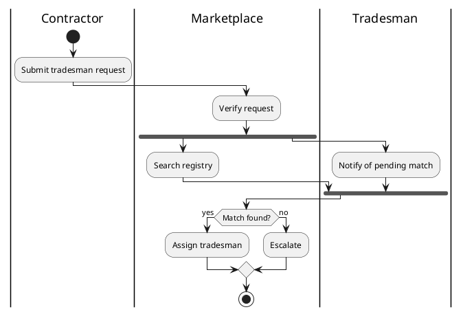

# Core Use Cases

## Canonical source

**Primary:** Löwy, *Righting Software*, Chapter 4 §2.1 "Core Use Cases" and §2.2 "The Architect's Mission".

**Supporting:**
- Ch. 3 §1 "Use Cases and Requirements"
- Ch. 4 §1 "Requirements and Changes"
- Ch. 4 §2 "Composable Design"

**Worked example:** Ch. 5 §1.4 "Use Cases" and the rest of ch. 5 §6 where each use case becomes a call chain. The TradeMe customer provided 8 use cases (Add Tradesman, Pay Tradesman, etc.) — the architect identified only **one** as core (Match Tradesman). Re-read the reasoning in ch. 5.

**Standard reference:** Appendix C §3.1a–c — capture behavior not functionality; describe with use cases; document nested conditions with activity diagrams.

## Input

State is git-as-DB: archistrator is a single Go-server repo whose canonical project state lives in `.aiarch/state/project.json` (a typed JSON aggregate). Markdown is a render-on-read of the typed state.

- The committed **mission** artifact → `.aiarch/state/project.json` → `.mission`
- The committed **glossary** artifact → `.glossary`
- The committed **volatilities** artifact → `.volatilities`
- The committed **scrubbedRequirements** artifact → `.scrubbedRequirements`
- The research corpus in `project.json`

**The futility of requirements (ch. 4 §1.3).** The use-case corpus is ALWAYS incomplete, duplicated, and partly contradictory — that is expected and fine, not a defect to remediate before starting. Per Löwy, *"you can design valid systems even with grossly impaired requirements."* Do not stall waiting for the corpus to be complete, and do not demand exhaustive requirements before proceeding: a composable design (the smallest set of components that satisfies the core, ch. 4 §2) makes the completeness of the corpus irrelevant to the validity of the decomposition. Work with the corpus you have; abstraction, not enumeration, is what makes the core use cases right.

## Output

The typed **`CoreUseCases`** model (Go shape in `internal/resourceaccess/projectstate/models_phase1.go`), committed to **`.aiarch/state/project.json` → `.coreUseCases`** — NOT a `core-use-cases.md` file; any markdown is a render-on-read of this slot. Per the two usage patterns (agentic/CI dispatch and local interactive), the agent emits the typed model and commits it into `.coreUseCases`; the server stages it (`StageArtifactForReview`) for the human review gate.

The model carries:

1. The **full raw list** of all use cases mentioned in research
2. The **2–6 core use cases** with behavior descriptions
3. An **essence rationale** (`essenceRationale`) on every CORE decision — the essence-of-the-business argument for why this use case is core (see Step 2); the symmetric twin of the non-core rejection reason
4. **Rejection reasons** for each non-core use case
5. **Activity diagrams** (PlantUML activity diagrams, new syntax) for use cases with nested conditions, **using role-based swimlanes when the use case crosses multiple roles/areas of interest, and fork bars when paths execute concurrently** — carried as diagram source on the typed use-case entries (the renderer emits them; they are not separate files)

## Procedure

### Step 1 — List every raw use case

Trawl the research corpus in `project.json` and the committed `.scrubbedRequirements`. List every distinct use case mentioned, in customer language. Don't filter yet. Don't rename yet.

Format:

```markdown
## Raw use cases (all 17 mentioned in research)

1. Add a tradesman to the registry
2. Pay a tradesman after a job
3. Match a customer request to a tradesman
4. Terminate a tradesman's registration
5. Onboard a contractor
...
```

### Step 2 — Abstract toward core

The book is unambiguous (ch. 4 §2.1): *"Most of the use cases are variations of other use cases. The main required behavior has numerous permutations—for example, the normal case, the incomplete case, the case for a specific customer in a particular locale, the error case, and so on. There are only two types of use cases: core use cases and all other use cases."*

For each raw use case, ask:
1. **Does this represent the essence of the business** — what differentiates the system, what creates business value?
2. **Or is this a permutation/utility** — onboarding, payment, account management?
3. **Could a different abstraction encompass several raw use cases?** Core use cases often need a **new name** not present in customer vocabulary.

Look at TradeMe (ch. 5) as the worked example. Customer gave 8 use cases; architect chose ONE as core (Match Tradesman) because:
- Match Tradesman is what differentiates TradeMe from competitors
- Add/Terminate/Pay tradesman are mechanics, not business essence
- Several customer-stated use cases were actually variations of matching under different conditions

Per ch. 4: *"A core use case will almost always be some kind of an abstraction of other use cases, and it may even require a new term or name to differentiate it from the rest."*

**Record the essence argument on every CORE decision.** Each use case you classify as core carries the typed `essenceRationale` field (nullable string, on the `UseCaseDecision`) — the symmetric twin of the non-core `rejectionReason` (Step 5). It states WHY this use case is the essence of the business per ch. 4 §2.1: shared by all customers, nearly immutable over time, differentiating — an abstraction, not a feature. A rationale that merely restates the feature ("the system matches tradesmen") is vacuous; the rationale must argue essence ("matching is what every customer buys, survives every requirements change, and is what competitors cannot do"). A core decision with a missing or empty `essenceRationale` is flagged by the machine backstop `DH-UC-ESSENCE-MISSING` (Warning) — but the backstop only catches absence; YOU are responsible for the rationale being a real essence argument.

### Step 3 — Target 2–6 core use cases

Per ch. 4 §2.1: *"the system will have only a handful of core use cases. In our practice at IDesign, we commonly see systems with surprisingly few core use cases. Most systems have as few as two or three core use cases, and the number seldom exceeds six."*

If you have >6, you have not abstracted enough. Push back on yourself.
If you have 1, you may have abstracted too far — look for distinct business pillars.

**Sanity check** (ch. 4): *"bring up a single-page marketing brochure for the system and count the number of bullets. You will likely have no more than three bullets."* The bullets ≈ the core use cases.

### Step 4 — Describe each core use case

For each core use case, write (if nested conditions exist, add an activity diagram — see the swimlane and fork/join guidance below):

```markdown
## Core Use Case: <Name>

**Actor:** Who triggers it
**Trigger:** What starts the flow — one of `clientAction` | `timer` | `busMessage`
**Outcome:** What the system delivers
**Success path:** One paragraph
**Alternative / error paths:** Bulleted list

**Activity diagram:** (PlantUML new syntax, role-based swimlanes)
```

**The trigger taxonomy is load-bearing, and it is machine-checked against the diagram** (`CC-TRIGGER-EVENT`, Error). Pick it honestly:

| Trigger | Who starts it | The diagram's entry | Downstream consequence |
|---|---|---|---|
| `clientAction` | a declared actor, through a Client | a `start` node | the chain roots `actor → Client → Manager`, so the use case **must declare ≥1 actor** (`CUC-ACTOR-REQUIRED`, Error) |
| `timer` | a schedule or timer — an external process in the client tier (ch. 5) | an **edge-less `timeEvent`** node (the UML hourglass) | the chain roots at the scheduling `Client → Manager` call |
| `busMessage` | another use case's queued message | an **edge-less `acceptEvent`** node | the chain roots at the queued `Manager → Manager` call that delivers it |

Classify by what the system actually does, not by what sounds richer: if the flow is dispatched by a scheduler, it is a `timer` even when the work it does is event-shaped. And a `busMessage` classification obliges the architecture to carry a real queued edge that delivers it — a trigger the model cannot produce is a claim the design does not keep.

Per App C §3.1c: *"Document all use cases that contain nested conditions with activity diagrams."* Use **PlantUML activity diagrams (new syntax)** — the `start` / `:action;` / `if (cond?) then (yes) ... else (no) ... endif` / `repeat ... repeat while (cond?)` / `switch (val?) case (x) ... endswitch` / `fork ... fork again ... end fork` / `stop` vocabulary. Use `goto`/`label` for arbitrary loop-backs the structured constructs can't capture. **Do not use Mermaid `flowchart`** — PlantUML activity is more expressive (swimlanes, structured switch, fork, goto/label) and renders via the project's PlantUML hook. Wrap every diagram in `@startuml` / `@enduml` so the validator picks it up.

**Swimlanes (Pass 1 — use-case modeling):** Löwy introduces swimlanes during use-case modeling (Ch. 5 §1.4 "Use Cases", "Simplifying the Use Cases"): *"It is useful to show the flow of control between roles, organizations, and other responsible entities, using 'swim lanes' in your activity diagrams"* — and notes that the technique will be used *"to both initiate and validate the design."* That means **two passes**: (1) here, labeling lanes by **area of interest / role / responsible entity** — NOT yet by subsystem; (2) later in [[the-method-architecture]] during call-chain validation (Pass 2), where each node is REALIZED by the call fragment naming the components that perform it. Note what Pass 2 is and is not on this platform: the lanes you draw here stay business roles forever — the component mapping lives in the realization, not in a relabeled lane. Add swimlanes to any use-case activity diagram that crosses more than one role or area of responsibility.

**Granularity rule — aim for ~3 lanes that map to future subsystems.** If your initial pass draws more than ~3 lanes, collapse sub-areas into their parent business concern. Löwy demonstrates this exact refactor at Ch. 5 §1.5 Fig 5-21→5-22: Fig 5-21 has 5 lanes (Client / Market / Regulations / Search / Membership); Fig 5-22 collapses to 3 (Client / Market / Membership) because *"Regulations and Search are all elements of the market"* — caption: *"This enables easy mapping to your subsystems design."* Each remaining lane should correspond to a future subsystem or an external participant — that is what *"to both initiate and validate the design"* means: the lanes you draw here pre-shape the subsystem boundaries you will commit to in [[the-method-architecture]]. **DON'T:** lanes are NEVER one-per-Manager, one-per-Engine, or one-per-ResourceAccess. Layer-typed lanes pre-bake the decomposition and defeat both Pass 1 and Pass 2.

**Fork/join:** Use a fork bar whenever two paths run **concurrently against the same subject** — for example, a publish-path and an observe-path against the same operated system, or a scheduled-cycle close and an event-driven dispute webhook against the same settlement cycle. Parallel execution is the central reason The Method prefers activity diagrams over flowcharts (Ch. 3 §1.1, Fig 3-2): *"You cannot represent parallel execution, blocking, or waiting for some event to take place in a flowchart. Activity diagrams, by contrast, incorporate a notion of concurrency."*

Example diagram showing both role-based swimlanes (Pass 1 — areas of interest, not subsystem names) and a fork. Lane labels are **business roles / areas of interest** (names a customer would recognise), never Method layer names — `Manager`, `Engine`, `ResourceAccess` are Pass 2 subsystem labels that belong in [[the-method-architecture]], not here.


```puml
@startuml
|Contractor|
start
:Submit tradesman request;
|Marketplace|
:Verify request;
fork
  :Search registry;
fork again
  |Tradesman|
  :Notify of pending match;
end fork
|Marketplace|
if (Match found?) then (yes)
  :Assign tradesman;
else (no)
  :Escalate;
endif
stop
@enduml
```

### Step 5 — Document the rejections

For every raw use case that did NOT make the core list, write one line explaining why:

```markdown
## Non-core use cases

| Raw use case | Why non-core |
|---|---|
| Pay tradesman | Standard payment mechanics; not business-differentiating |
| Add tradesman | Onboarding utility; a permutation of identity management |
| Terminate tradesman | Inverse of add; same observation |
| ... | ... |
```

This is important for two reasons:
1. **Trail for review.** PM and stakeholders can challenge the architect's rejection of any "obvious" use case.
2. **Future evolution.** When `/add-use-case` runs later, the non-core list in `.coreUseCases` confirms whether the new use case is a known variation or genuinely new.

### Step 6 — PM ratification

The PM is dispatched only at this checkpoint, not earlier. They review:

- Are the architect's core use case picks compatible with customer expectations?
- Is any rejected use case actually critical to a customer?
- Are the names recognizable to customers (or at least translatable)?

The PM **can push back**, but cannot unilaterally veto. The architect has abstraction taste; the PM has customer reality. Both must agree.

If they cannot agree, the dispute usually means one of:
- The architect over-abstracted (resolve by promoting one rejected use case to core)
- The PM is feature-attached (resolve by educating: features are integration, not architecture)

## Draft-job doctrine (CI dispatch)

This is the normative task the CI draft job (and a local `/system-design` run) executes to produce the `CoreUseCases`. It is self-contained: everything a draft agent needs to draft a sound set of core use cases — including how to compose each use case's typed activity diagram — is stated here.

Select the CORE use cases by ABSTRACTION, not by listing what the customer asked for. For each candidate ask: does this capture the ESSENCE of the business (what differentiates it, what creates value), or is it a permutation/utility (onboarding, payment, account admin)? Could a single higher abstraction — often a NEW name not in the customer's vocabulary — subsume several raw use cases? Target 2-6 core use cases; if you have more than 6 you have not abstracted enough. Sanity check: a one-slide brochure for the system would have roughly this many bullets. Record each rejected permutation with its rejection reason and link it to the core it permutes by setting its `variationOf` to that core use case's NAME (exactly as you wrote it). Record on each CORE decision its `essenceRationale` — the symmetric twin of the nonCore rejection reason: WHY this use case is the essence of the business (shared by all customers, nearly immutable, differentiating — an abstraction, not a feature). A core decision without one is flagged `DH-UC-ESSENCE-MISSING` (Warning); a rationale that just restates the feature is vacuous and will be sent back in critique.

EXERCISE THE VOLATILITIES: the committed `.volatilities` is an input to your flows, not a backdrop — each accepted volatility should be exercised, its seam crossed, by at least one core use case's flow, or its absence explicitly justified in the draft. Flows that exercise NO committed volatility are restating the customer's current manual process, not the product's required behavior.

IDENTITY BY NAME: every use case and actor is identified by its human-readable NAME — you do NOT emit any id. Use case names must be UNIQUE; actor roles must be unique within a use case. Reference the core use case in `variationOf` by its name; the server assigns and resolves all internal ids.

### Activity diagram rules

The CI draft job emits each use case's `activity` as a typed node/edge model (not PlantUML — the PlantUML guidance above is for human-readable rendering; the committed draft carries the typed graph the server validates). The rules below are what the machine validates and are copied verbatim from the draft doctrine.

ACTIVITY DIAGRAM: EVERY use case — CORE and SUPPORTING (nonCore) alike — MUST carry a NON-EMPTY `activity`: a WELL-FORMED UML activity diagram, a graph of `nodes` (each `{ref, kind, label, roleName, linkedActor, decidedBy?}`) and `edges` (each `{from, to, kind, guard}`). There is NO "purely linear, so leave it null" exemption — a use case with a null or empty `activity` (missing `nodes` or `edges`) is an INCOMPLETE DRAFT and will be rejected. At an ABSOLUTE MINIMUM the diagram has an ENTRY (see below), at least one action node, and an end node wired entry -> action -> end; a use case that branches or runs steps concurrently adds decision/merge or fork/join per the rules below. Walk the use case's real flow — do not stub a placeholder one-action diagram to satisfy the rule when the use case genuinely has steps. NEVER emit a bare string for `activity` — it is always a non-empty object with `nodes` and `edges`.

IDENTITY BY NAME (no ids): you NEVER emit any opaque id or uuid. Give each node a short `ref` slug of your own (e.g. `n1`, `n2`) UNIQUE within the diagram; edges reference nodes by that `ref` in `from`/`to`. `linkedActor` (optional) is an actor's ROLE name from this use case. The server resolves all of these by name.

REALIZATION HAND-OFF: this diagram is what the architecture is validated against. In [[the-method-architecture]] Step 9 every `action`, `timeEvent`, and `acceptEvent` node you write here MUST be realized by a call fragment naming the components that perform it — the join is by node, and it is machine-checked at Error severity (`CC-COVERAGE`). Two consequences for you, now: write action labels that name real work (a node whose label is vague is a node nobody can realize honestly), and do NOT pad the diagram with steps the system does not perform. A node at which the system genuinely does no work — a precondition, an external system's convergence, an act the human performs outside every Client, the render of a result already returned — is a `note`, not an `action`; notes carry no realization obligation, and using one honestly here is far better than forcing a fabricated call later. Two padding shapes that have ACTUALLY dead-ended an architecture draft against this rule, both to avoid: (1) an `action` for a component's INTERNAL choice of what to do next ("decide which verb applies", "select the matching todos") — verb selection inside one component is not a system step; fold it into the guard of the decision it feeds, or into the action that applies the result; (2) a retrieve-then-select PAIR ("fetch the list" → "pick the matching items") — a single read returns what was asked for, so any honest realization leaves one of the pair call-less; write ONE fresh-select action. `linkedActor` is likewise a claim the realization must keep: a node laned to an actor must have that actor as an endpoint of its fragment (`CC-ACTOR-LANE`), so lane ONLY Client-touching human actors — an external system that can never legally call a Client is a lane by `roleName` alone.

Node kinds and their edge cardinality:
- start: 0 incoming, exactly 1 outgoing. The entry of a `clientAction` use case.
- timeEvent: the UML accept-time-event (hourglass) — the entry of a `timer` use case. NO incoming edge; exactly 1 outgoing.
- acceptEvent: the UML accept-event action — the entry of a `busMessage` use case. NO incoming edge; exactly 1 outgoing.
- action: a step; 1 incoming, 1 outgoing.
- decision: a CHOICE; 1 incoming, >=2 outgoing.
- merge: rejoins a decision's alternative branches; >=2 incoming, 1 outgoing.
- fork: splits into CONCURRENT paths; 1 incoming, >=2 outgoing.
- join: synchronizes concurrent paths; >=2 incoming, 1 outgoing.
- note: documentation, NOT flow work. Either in-flow (edges intact — an out-of-band or response-render step) or free-floating and edge-less (ambient context, an outside-the-boundary effect). Carries no realization.
- end: a final node; >=1 incoming, 0 outgoing.

ENTRY SEMANTICS: a diagram's entry is a `start` node OR an edge-less `timeEvent`/`acceptEvent` node. (This SUPERSEDES the older "exactly one start node" rule.) An event-triggered use case needs NO start node for its machine trigger — the event node IS that entry — and putting a `start` IN FRONT OF the machine trigger is the defect: every start-rooted path's first call must be `actor -> Client`, which a machine-triggered flow cannot honestly make, so the chain fails `CC-PATH-CONNECTED` (note it is that rule, not `CC-TRIGGER-EVENT`, which only checks that the required event entry EXISTS and never objects to a stray start).

A diagram MAY have more than one entry, and a `timer`/`busMessage` use case MAY legitimately keep a `start` — when the use case genuinely has a SECOND, human-initiated entry of its own. Each entry is walked as its own path, and disjoint entry subgraphs are legal. **Worked example, live and gate-green: "operate a delivered system"** — trigger `timer`, carrying an edge-less `timeEvent` entry for the reconcile sweep AND a `start` entry for the operator's own deploy/withdraw path, which roots honestly at `operator -> Client`. So the test is not "does a start node exist" but **"does every start-rooted path begin with a real actor gesture"**. Do NOT fake concurrency with a fork to fuse independent entries into one token: a fork is CONCURRENCY within one flow, not a way to give a diagram two beginnings.

TRIGGER ALIGNMENT (machine-checked, `CC-TRIGGER-EVENT`, Error): a `timer` use case MUST have >=1 edge-less `timeEvent` entry; a `busMessage` use case MUST have >=1 edge-less `acceptEvent` entry; a `clientAction` use case MUST have NO event-node entries. And a `clientAction` use case MUST declare >=1 actor (`CUC-ACTOR-REQUIRED`, Error) — with none, nothing can root its chain.

DECIDEDBY (optional, `decision`/`switch` ONLY): names WHO makes the choice at a branch — a System component NAME or an actor ROLE of this use case. Set it when the honest decider is not the Manager running the flow: the verdict is an Engine's output (a policy engine returning Retry|Escalate), a human's act (approve, revoke, take over), or an external provider's answer (a gateway approving a charge). LEAVE IT ABSENT when the guard is the Manager's own state read — absence reads as the Manager, which is then the honest attribution, and a wrong explicit decider is worse than none. Placement rule: the decider must be a plausible endpoint of the eventual call chain — for a component, the chain can reach it; for an actor, the diagram has an actor->Client touchpoint. `decidedBy` on any other node kind, or a value resolving to neither a component nor one of THIS use case's actors, is `CC-DECIDED-BY` (Error). NOTE: `decidedBy` puts component names into the requirements artifact, so a later component RENAME must retarget this field in the SAME amendment as the model — renames are cross-slot events.

Put every node in its business-role swim-lane via `roleName` (e.g. "Customer", "Trusted System") — a business role or area of interest, NOT a Method layer or subsystem name.

Edge kinds:
- guardedFlow: carries a `guard` condition; used ONLY on the outgoing edges of a decision.
- controlFlow: no guard (set `guard` to ""); EVERY other edge, including ALL fork outgoing edges.

Composition rules you MUST follow (a violation is rejected and redrafted):
0. EVERY use case has a non-empty `activity` with at least ONE ENTRY — a `start` node (0 incoming, 1 outgoing) for a `clientAction` use case, or an edge-less `timeEvent`/`acceptEvent` node for a `timer`/`busMessage` one, aligned with the use case's trigger — plus at least ONE action node and at least ONE end node. A diagram-less or node-less use case is an incomplete draft. This is NON-NEGOTIABLE for core use cases and equally REQUIRED for supporting (nonCore) ones; never leave `activity` null.
1. A decision is a CHOICE: it MUST have >=2 outgoing guardedFlow edges, each with a distinct, mutually-exclusive guard; give exactly ONE edge the guard `[else]` for the remaining case. Its branches MUST reconverge at a merge node before the flow continues — a branch must not run straight into the next step or dangle.
2. A fork is CONCURRENCY (not a choice): >=2 outgoing controlFlow (UNguarded) edges, ALL of which run; the concurrent paths MUST reconverge at a join. Never put a guard on a fork edge.
3. guardedFlow edges originate ONLY from decision nodes; every other node's outgoing edges are controlFlow.
4. A LOOP is a merge loop-head -> ...body... -> a decision whose `[repeat]` guarded edge BACK-EDGES to the loop-head merge and whose `[else]` guarded edge exits.

Decision/merge model an ALTERNATIVE (exactly one branch taken); fork/join model CONCURRENCY (all paths taken) — do not confuse them.

Worked examples (each node carries your own short `ref` slug — NOT a uuid; edges reference those refs):

if/else — a decision's two branches reconverge at a merge:

```json
{"nodes":[{"ref":"n1","kind":"decision","label":"Is the item actionable?","roleName":"Trusted System"},{"ref":"n2","kind":"action","label":"Create next step and assign context","roleName":"Trusted System"},{"ref":"n3","kind":"action","label":"File or incubate item","roleName":"Trusted System"},{"ref":"n4","kind":"merge","label":"","roleName":"Trusted System"}],"edges":[{"from":"n1","to":"n2","kind":"guardedFlow","guard":"[actionable]"},{"from":"n1","to":"n3","kind":"guardedFlow","guard":"[else]"},{"from":"n2","to":"n4","kind":"controlFlow","guard":""},{"from":"n3","to":"n4","kind":"controlFlow","guard":""}]}
```

fork/join — two concurrent paths synchronize:

```json
{"nodes":[{"ref":"n1","kind":"fork","label":"","roleName":"Marketplace"},{"ref":"n2","kind":"action","label":"Search the registry","roleName":"Marketplace"},{"ref":"n3","kind":"action","label":"Notify the tradesman","roleName":"Tradesman"},{"ref":"n4","kind":"join","label":"","roleName":"Marketplace"}],"edges":[{"from":"n1","to":"n2","kind":"controlFlow","guard":""},{"from":"n1","to":"n3","kind":"controlFlow","guard":""},{"from":"n2","to":"n4","kind":"controlFlow","guard":""},{"from":"n3","to":"n4","kind":"controlFlow","guard":""}]}
```

event entry — a `timer` use case enters at an edge-less `timeEvent` (no `start` node anywhere in the diagram), and a `decision` names its decider:

```json
{"nodes":[{"ref":"n1","kind":"timeEvent","label":"Settlement cycle comes due","roleName":"Trusted System"},{"ref":"n2","kind":"action","label":"Charge the customer for the cycle","roleName":"Trusted System"},{"ref":"n3","kind":"decision","label":"Charge succeeded?","roleName":"Trusted System","decidedBy":"MerchantGateway"},{"ref":"n4","kind":"action","label":"Close the cycle settled","roleName":"Trusted System"},{"ref":"n5","kind":"action","label":"Record the decline and close the cycle unpaid","roleName":"Trusted System"},{"ref":"n6","kind":"merge","label":"","roleName":"Trusted System"}],"edges":[{"from":"n1","to":"n2","kind":"controlFlow","guard":""},{"from":"n2","to":"n3","kind":"controlFlow","guard":""},{"from":"n3","to":"n4","kind":"guardedFlow","guard":"[paid]"},{"from":"n3","to":"n5","kind":"guardedFlow","guard":"[else]"},{"from":"n4","to":"n6","kind":"controlFlow","guard":""},{"from":"n5","to":"n6","kind":"controlFlow","guard":""}]}
```

(`decidedBy` names the gateway because the succeed/decline verdict is genuinely the provider's, not the Manager's — and the gateway is reachable from this chain through its ResourceAccess, so the placement rule holds. The decision itself needs no realization step: its guard is answered by the charge call `n2` already draws.)

while-loop — a decision back-edges to the loop-head merge:

```json
{"nodes":[{"ref":"n1","kind":"merge","label":"","roleName":"Trusted System"},{"ref":"n2","kind":"action","label":"Process the next item","roleName":"Trusted System"},{"ref":"n3","kind":"decision","label":"More items?","roleName":"Trusted System"},{"ref":"n4","kind":"end","label":"","roleName":"Trusted System"}],"edges":[{"from":"n1","to":"n2","kind":"controlFlow","guard":""},{"from":"n2","to":"n3","kind":"controlFlow","guard":""},{"from":"n3","to":"n1","kind":"guardedFlow","guard":"[more]"},{"from":"n3","to":"n4","kind":"guardedFlow","guard":"[else]"}]}
```

## Exit criteria (for router)

`.aiarch/state/project.json` → `.coreUseCases` holds the typed `CoreUseCases` model with:
- Raw list (complete)
- 2–6 core use cases (each with actor, trigger, outcome, paths, and a non-empty activity diagram — required on every use case, core and variation alike)
- Every diagram's entry aligned with its trigger: `start` for `clientAction` (which also declares ≥1 actor), an edge-less `timeEvent` for `timer`, an edge-less `acceptEvent` for `busMessage`
- An `essenceRationale` on every core decision — a real essence-of-the-business argument, not a feature restatement (machine backstop: `DH-UC-ESSENCE-MISSING`, Warning)
- Rejection table for non-core
- PM ratification noted

Move to `the-method-architecture`.

## Anti-patterns to reject

- **>6 core use cases** — over-listing; abstract further.
- **Core use cases named exactly as customers named them** — usually means no abstraction happened. Force a rename to expose the underlying business essence.
- **CRUD as core** ("Create Order", "Update Order") — these are mechanics, never core.
- **No activity diagram** for a use case that has alternative paths — App C requires it. Activity diagrams use PlantUML new syntax; Mermaid `flowchart` is no longer accepted.
- **Rejections without reasons** — every non-core needs a one-line justification.
- **A `start` node in front of a machine trigger** — the entry of a timer/message flow is the edge-less `timeEvent`/`acceptEvent` node; a `start` prepended to it demands an actor→Client root the flow cannot honestly make (`CC-PATH-CONNECTED`). A `start` that opens a genuine SECOND, human-initiated entry in the same use case is legal and correct — see ENTRY SEMANTICS.
- **A `clientAction` use case with no declared actor** — nothing can root its chain (`CUC-ACTOR-REQUIRED`, Error).
- **A trigger the architecture cannot produce** — `busMessage` with no queued edge behind it anywhere in the model. Reclassify honestly or let the missing edge justify itself on its own merits.
- **Padding the diagram with steps the system does not perform** — every `action` becomes a realization obligation in [[the-method-architecture]]; a node with no honest work is a `note`, and inventing a call to cover it later is the worse defect.
- **`decidedBy` naming a component the chain can never reach** — over-attribution; leave it absent and let the entry Manager carry the branch.
- **Laning a node to an external system as `linkedActor`** — only Client-touching human actors are `linkedActor`; everything else is a lane by `roleName` (`CC-ACTOR-LANE`).
- **Core decisions without an essence argument** — every core needs an `essenceRationale` that argues essence (shared by all customers, nearly immutable, differentiating), not one that restates the feature. Machine backstop: `DH-UC-ESSENCE-MISSING` (Warning).
- **Missing swimlanes on a multi-role use case** — any use case that crosses more than one role or area of interest must have swimlanes. Omitting them loses the clarity that Löwy shows as essential for *"transform, clarify, and consolidate the raw data"* (Ch. 5 §1.4, "Simplifying the Use Cases"). Note: lanes here are labeled by area of interest/role, not by subsystem (that remapping happens in Pass 2 during [[the-method-architecture]]).
